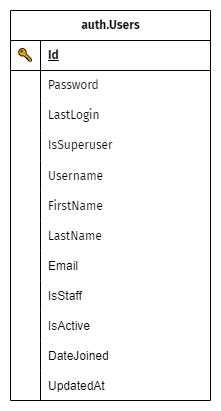
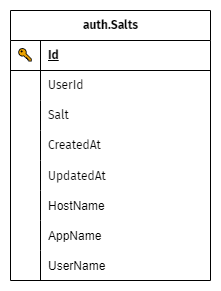

# 💠 AUTH

## TABLES
<!-- <h3 id="users-table">🔸 USUARIOS (Users)</h3> -->
### 🔸 USUARIOS (Users) {#users-table}



```sql
CREATE TABLE [auth].[Users]
(
     [Id]              [CHAR](24)          NOT NULL
    ,[Password]        [NVARCHAR](255)     NOT NULL
    ,[LastLogin]       [DATETIMEOFFSET]    NULL
    ,[IsSuperuser]     [BIT]               NULL
    ,[Username]        [VARCHAR](150)      NOT NULL
    ,[FirstName]       [NVARCHAR](250)     NULL
    ,[LastName]        [NVARCHAR](250)     NULL
    ,[Email]           [NVARCHAR](250)     NULL
    ,[IsStaff]         [BIT]               NULL
    ,[IsActive]        [BIT]               NOT NULL
    ,[DateJoined]      [DATETIMEOFFSET]    NULL
    ,[UpdatedAt]       [DATETIMEOFFSET]    NULL
)
```
### Referencia:
+ 🔑 **Id**
    <br> Identificador único conformado de un segmento numérico y uno alphanumérico.
    <br>
    <table>
        <tr>
            <td style="font-style:italic">estructura</td>
            <td><code style="color:aquamarine">[0-9]{15}</code><code style="color:crimson">—</code><code style="color:aquamarine">[0-9a-zA-Z]{6}</code></td>
        </tr>
        <tr>
            <td style="font-style:italic">ejemplo</td>
            <td><code>189785402564147-x2f587</code></td>
        </tr>
    </table>
+ **Password**
    <br> Contraseña encriptada con algoritmo `SHA`.
+ **LastLogin**
    <br> Fecha y hora del último inicio de sesión del usuario.
+ **IsSuperuser**
    <br> Determina si el usuario es un superuser. El valor por defecto es `cero` (`0`).
+ **Username**
    <br> Nombre de usuario. Usado para el inicio de sesión.
+ **FirstName**
    <br> Nombres. El valor por defecto es una `cadena vacía` (`''`).
+ **LastName**
    <br> Apellidos. El valor por defecto es una `cadena vacía` (`''`).
+ **Email**
    <br> Correo electrónico. El valor por defecto es una `cadena vacía` (`''`).
+ **IsStaff**
    <br> Determina si el usuario pertenece al staff. Valor por defecto `cero` (`0`).
+ **IsActive**
    <br> Indicador de habilitación. Determina si el usuario está habilitado o deshabilitado. Valor por defecto `uno` (`1`).
+ **DateJoined**
    <br> Fecha y hora cuando el usuario fue registrado en el sistema.
+ **UpdatedAt**
    <br> Fecha y hora cuando la información del usuario fue actualizada por última vez.

### 🔸 SALES (Salts)
Las **sales** (*salt*) son cadenas usadas en la encriptación de contraseñas de los usuarios.



```sql
CREATE TABLE [auth].[Salts]
(
     [Id]          [BIGINT] IDENTITY(1,1)  NOT NULL
    ,[UserId]      [CHAR](24)              NOT NULL
    ,[Salt]        [NVARCHAR](255)         NOT NULL
    ,[CreatedAt]   [DATETIMEOFFSET]        NULL
    ,[UpdatedAt]   [DATETIMEOFFSET]        NULL
    ,[HostName]    [NVARCHAR](128)         NULL
    ,[AppName]     [NVARCHAR](128)         NULL
    ,[UserName]    [NVARCHAR](128)         NULL
)
```

### Referencia:
+ 🔑 **Id**
    <br> Identificador único autogenerado de tipo entero (_BIGINT_ | _INT64_).
    <br>
+ 🔗 **UserId**
    <br> Identificador de usuario (_User.Id_)
    <br> _ref._: [User](#users-table) 🌐
+ **Salt**
    <br> Cadena usada en la encriptación.
+ **CreatedAt**
    <br> Fecha y hora de inserción.
+ **UpdatedAt**
    <br> Fecha y hora de la última actualización realizada.

<small>**・ Campos de Auditoría ・**</small>

+ **HostName**
    <br> Estación de trabajo desde donde se realizó la actualización.
+ **AppName**
    <br> Nombre del aplicativo desde donde se realizó la actualización.
+ **UserName**
    <br> Nombre del usuario que realizó la actualización.

