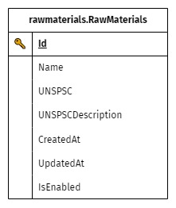

# Materias Prima (Raw Materials)

## Estructura



```sql
CREATE TABLE [rawmaterials].[RawMaterials] (
      [Id]                  [CHAR](24)          NOT NULL
    , [Name]                [NVARCHAR](255)     NOT NULL
    , [UNSPSC]              [CHAR](11)          NULL
    , [UNSPSCDescription]   [NVARCHAR](400)     NULL
    , [CreatedAt]           [DATETIMEOFFSET]    NULL
    , [UpdatedAt]           [DATETIMEOFFSET]    NULL
    , [IsEnabled]           [BIT]               NOT NULL
)
```
### Referencia:
+ 🔑 **Id**
    <br> Identificador único conformado de un segmento numérico y uno alphanumérico. En total cuenta con un largo de 24 caracteres (incluyendo el _guión_).
    <br>
    <table>
        <tr>
            <td style="font-style:italic">estructura</td>
            <td><code style="color:aquamarine">[0-9]{15}</code><code style="color:crimson">—</code><code style="color:aquamarine">[0-9a-zA-Z]{8}</code></td>
        </tr>
        <tr>
            <td style="font-style:italic">ejemplo</td>
            <td><code>173004313244300-94IGRP6f</code></td>
        </tr>
    </table>
+ **Name**
    <br> Nombre de la materia prima
+ **UNSPSC**
    <br> Código estándar de Productos y Servicios de las Naciones Unidas.
    <br> *info.*: [UNSPSC](https://es.wikipedia.org/wiki/UNSPSC)🌐 **￤** [CUBSO](https://www.gob.pe/8233-acceder-al-catalogo-unico-de-bienes-servicios-y-obras-cubso-del-seace)🌐
+ **UNSPSCDescription**
    <br> Descripción estándar de Productos y Servicios de las Naciones Unidas.
+ **CreatedAt**
    <br> Fecha y hora de registro (inc. información de zona horaria).

+ **UpdatedAt**
    <br> Fecha y hora de última actualización (inc. información de zona horaria).
+ **IsEnabled**
    <br> Indicador de habilitación. Determina si el registro está habilitado o deshabilitado.